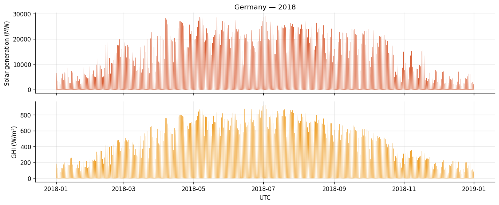
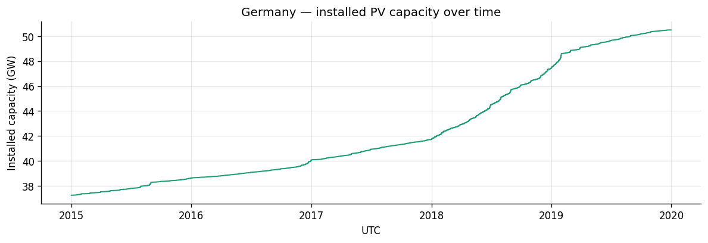
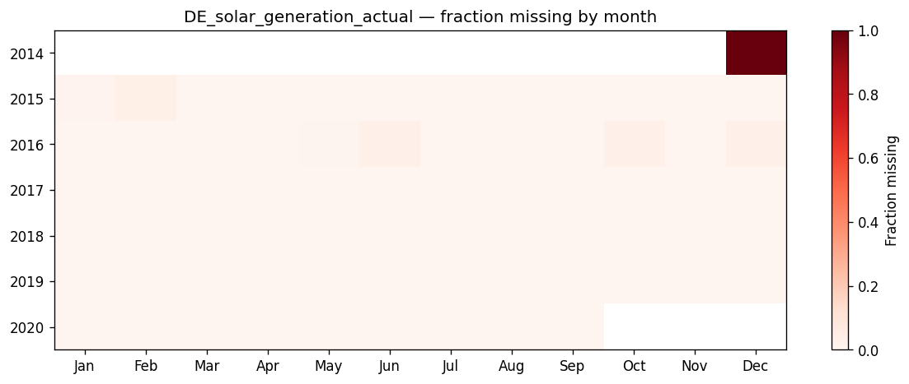

# Data Quality Report

_Generated by `scripts/data_quality_report.py`. Re-run after any change to raw data._

Dataset: OPSD time series v2020-10-06, OPSD weather v2020-09-16.

---

## 1. Temporal coverage

| Source       | Start                | End                  | Rows        |
|--------------|----------------------|----------------------|-------------|
| Time series  | 2014-12-31 23:00:00+00:00           | 2020-09-30 23:00:00+00:00             |     50,401 |
| Weather      | 1980-01-01 00:00:00+00:00           | 2019-12-31 23:00:00+00:00             |    350,640 |

**Usable overlap:** 2014-12-31 23:00:00+00:00 → 2019-12-31 23:00:00+00:00 (43,825 hours, ~5.0 years).

This is the universe we model on. Everything before 2014-12-31 has weather but no target;
everything after 2019-12-31 has target but no weather. Both are unusable for supervised training.

## 2. Missingness

### Aggregate (all years)

| source      | column                                |   present_pct |
|:------------|:--------------------------------------|--------------:|
| time_series | DE_solar_capacity                     |         86.9  |
| time_series | IT_solar_generation_actual            |         86.91 |
| time_series | DE_solar_generation_actual            |         99.79 |
| time_series | DE_50hertz_solar_generation_actual    |         99.97 |
| time_series | DE_transnetbw_solar_generation_actual |         99.97 |
| time_series | DE_amprion_solar_generation_actual    |         99.97 |
| time_series | DE_tennet_solar_generation_actual     |         99.98 |
| time_series | DE_load_actual_entsoe_transparency    |        100    |
| weather     | DE_temperature                        |        100    |
| weather     | DE_radiation_direct_horizontal        |        100    |
| weather     | DE_radiation_diffuse_horizontal       |        100    |
| weather     | IT_temperature                        |        100    |
| weather     | IT_radiation_direct_horizontal        |        100    |
| weather     | IT_radiation_diffuse_horizontal       |        100    |

### DE_solar_generation_actual by year

|   year |   present_pct |
|-------:|--------------:|
|   2014 |          0    |
|   2015 |         99.65 |
|   2016 |         99.18 |
|   2017 |        100    |
|   2018 |        100    |
|   2019 |        100    |
|   2020 |        100    |

Aggregate percentages can hide structural gaps. Always check by year.

## 3. Anomalies and impossible values

| Check                                        |     Count | Notes |
|----------------------------------------------|----------:|-------|
| `DE_solar_generation_actual` < 0             |         0 | 0.000% of rows. Typically inverter calibration drift; clip to 0 in preprocessing. |
| Night-time (22–04 UTC) solar > 1 MW          |     1,952 | Should be ~0. Any non-zero count is a red flag. |
| Temperature outside [-30, +45] °C            |         0 | Germany never reaches these. |
| Night-time GHI > 1 W/m² (combined direct+diffuse) |     3,523 | Reanalysis artifact; should be exactly 0. |

These aren't necessarily errors to remove — but they are decisions to make explicitly
in preprocessing, and the decision belongs in code, not in your head.

## 4. Physical sanity: does irradiance predict generation?

**Overall Pearson correlation:** DE solar generation ↔ DE GHI = **0.9739**
(over 43,721 hourly observations).

This is the headline number for the project. Anything above ~0.9 means the
physics-informed thesis is viable; anything below ~0.7 would be cause for
concern. We are comfortably above the threshold.

### Correlation by month

| Month |  Corr | |  Month |  Corr |
|------:|------:|-|-------:|------:|
|   Jan | 0.906 | |   Jul | 0.979 |
|   Feb | 0.946 | |   Aug | 0.982 |
|   Mar | 0.964 | |   Sep | 0.974 |
|   Apr | 0.976 | |   Oct | 0.955 |
|   May | 0.973 | |   Nov | 0.946 |
|   Jun | 0.977 | |   Dec | 0.933 |

Months with lower correlation tell us where a pure-linear physics prior will
struggle most — typically winter, when low sun angles, snow, and increased
diffuse fraction make the GHI → output mapping less direct. This is exactly
the regime where the learned residual on top of the physics prior earns its keep.

## 5. Installed capacity growth

| Year | Min (MW) | Max (MW) |
|-----:|---------:|---------:|
| 2014 |   37,248 |   37,248 |
| 2015 |   37,248 |   38,631 |
| 2016 |   38,631 |   40,089 |
| 2017 |   40,089 |   41,731 |
| 2018 |   41,731 |   47,480 |
| 2019 |   47,480 |   50,508 |

Germany's installed PV capacity grew **~36%** across the dataset.
A naive chronological train/test split therefore trains on a smaller grid and
tests on a larger one — guaranteed distribution shift. Two ways to handle it:

1. **Normalize generation by capacity** (turn MW into a capacity factor in [0,1]).
2. **Include capacity as a feature** so the model learns the scaling explicitly.

We'll use approach 1 as the default; it's cleaner and decouples the forecasting
problem from the capacity-tracking problem.

## 6. Figures

